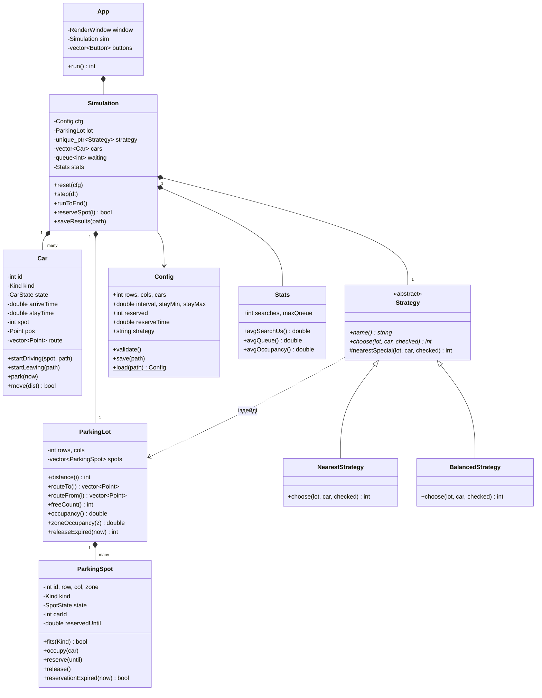

# UML класс диаграммасы

```mermaid
classDiagram
    class Car {
        -int id
        -Kind kind
        -CarState state
        -double arriveTime
        -double stayTime
        -int spot
        -Point pos
        -vector~Point~ route
        +startDriving(spot, path)
        +startLeaving(path)
        +park(now)
        +move(dist) bool
    }
    class ParkingSpot {
        -int id, row, col, zone
        -Kind kind
        -SpotState state
        -int carId
        -double reservedUntil
        +fits(Kind) bool
        +occupy(car)
        +reserve(until)
        +release()
        +reservationExpired(now) bool
    }
    class ParkingLot {
        -int rows, cols
        -vector~ParkingSpot~ spots
        +distance(i) int
        +routeTo(i) vector~Point~
        +routeFrom(i) vector~Point~
        +freeCount() int
        +occupancy() double
        +zoneOccupancy(z) double
        +releaseExpired(now) int
    }
    class Strategy {
        <<abstract>>
        +name()* string
        +choose(lot, car, checked)* int
        #nearestSpecial(lot, car, checked) int
    }
    class NearestStrategy {
        +choose(lot, car, checked) int
    }
    class BalancedStrategy {
        +choose(lot, car, checked) int
    }
    class Config {
        +int rows, cols, cars
        +double interval, stayMin, stayMax
        +int reserved
        +double reserveTime
        +string strategy
        +validate()
        +save(path)
        +load(path)$ Config
    }
    class Stats {
        +int searches, maxQueue
        +avgSearchUs() double
        +avgQueue() double
        +avgOccupancy() double
    }
    class Simulation {
        -Config cfg
        -ParkingLot lot
        -unique_ptr~Strategy~ strategy
        -vector~Car~ cars
        -queue~int~ waiting
        -Stats stats
        +reset(cfg)
        +step(dt)
        +runToEnd()
        +reserveSpot(i) bool
        +saveResults(path)
    }
    class App {
        -RenderWindow window
        -Simulation sim
        -vector~Button~ buttons
        +run() int
    }

    Strategy <|-- NearestStrategy
    Strategy <|-- BalancedStrategy
    ParkingLot "1" *-- "many" ParkingSpot
    Simulation "1" *-- "1" ParkingLot
    Simulation "1" *-- "many" Car
    Simulation "1" *-- "1" Strategy
    Simulation --> Config
    Simulation *-- Stats
    App *-- Simulation
    Strategy ..> ParkingLot : іздейді
```
